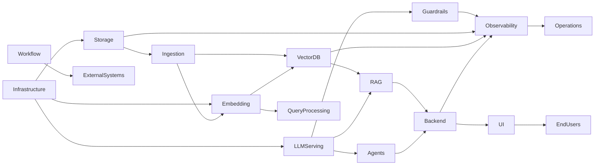

# AI System Architecture Landscape

A comprehensive reference for modern AI system components, from data ingestion to user interfaces, across local, hybrid, and cloud deployments.

---

## Table of Contents

1. [System Overview](#system-overview)
2. [Data Sources & Ingestion](#1-data-sources--ingestion)
3. [Data Storage & Object Stores](#2-data-storage--object-stores)
4. [Structured Databases](#3-structured-databases)
5. [Vector Databases & Search](#4-vector-databases--search)
6. [Embedding Models & Services](#5-embedding-models--services)
7. [LLM Inference & Model Serving](#6-llm-inference--model-serving)
8. [Prompting, Context Assembly & RAG Frameworks](#7-prompting-context-assembly--rag-frameworks)
9. [Agent & Orchestration Frameworks](#8-agent--orchestration-frameworks)
10. [Workflow Automation & Integration Platforms](#9-workflow-automation--integration-platforms)
11. [Evaluation, Guardrails & Safety](#10-evaluation-guardrails--safety)
12. [Observability, Logging & Monitoring](#11-observability-logging--monitoring)
13. [API Gateways & Backend Services](#12-api-gateways--backend-services)
14. [Chat, UI & End-User Applications](#13-chat-ui--end-user-applications)
15. [Coding & Developer Productivity Tools](#14-coding--developer-productivity-tools)
16. [Deployment, Runtime & Infrastructure Layers](#15-deployment-runtime--infrastructure-layers)

---

## System Overview

```
┌─────────────────────────────────────────────────────────────────────────────────────┐
│                              END-USER APPLICATIONS                                  │
│                    Chat UIs │ Web Apps │ APIs │ Developer Tools                     │
├─────────────────────────────────────────────────────────────────────────────────────┤
│                              API GATEWAY / BACKEND                                  │
├───────────────────────────────┬─────────────────────────────────────────────────────┤
│     ORCHESTRATION LAYER       │           EVALUATION & SAFETY                       │
│  Agents │ Workflows │ RAG     │     Guardrails │ Logging │ Observability            │
├───────────────────────────────┴─────────────────────────────────────────────────────┤
│                              AI INFERENCE LAYER                                     │
│              LLM Serving │ Embedding Services │ Model APIs                          │
├─────────────────────────────────────────────────────────────────────────────────────┤
│                              DATA LAYER                                             │
│        Vector DBs │ Structured DBs │ Object Storage │ Document Stores               │
├─────────────────────────────────────────────────────────────────────────────────────┤
│                              INFRASTRUCTURE                                         │
│                 Containers │ Orchestration │ Cloud Platforms                        │
└─────────────────────────────────────────────────────────────────────────────────────┘
```

---

## 1. Data Sources & Ingestion

### Architectural Role
The entry point for all information that will be processed, embedded, or retrieved by the AI system. Handles extraction, transformation, and normalization of raw content into processable formats.

### Problem Solved
Converts heterogeneous source material (documents, APIs, databases, web content) into structured, chunked content suitable for embedding and retrieval.

### Layer Characteristics

| Aspect | Value |
|--------|-------|
| Required | Mandatory for RAG; Optional for pure chat |
| State | Stateless (processing) or Event-driven (streaming) |
| Interaction | Feeds → Storage Layer, Embedding Services |

### Common Data Sources

| Source Type | Examples |
|-------------|----------|
| Documents | PDF, DOCX, Markdown, HTML |
| Structured | SQL databases, CSV, JSON |
| Unstructured | Images, audio transcripts |
| Real-time | APIs, webhooks, message queues |
| Web | Scraped content, RSS feeds |

### Processing Stages
1. **Extraction** - Parse raw content from source format
2. **Cleaning** - Remove noise, normalize encoding
3. **Chunking** - Split into retrieval-appropriate segments
4. **Metadata enrichment** - Add source, timestamp, tags

---

## 2. Data Storage & Object Stores

### Architectural Role
Persistent storage for raw documents, processed artifacts, model weights, and system assets. Serves as the foundational data tier.

### Problem Solved
Provides durable, scalable storage for unstructured data that does not fit relational models. Enables separation of compute and storage.

### Layer Characteristics

| Aspect | Value |
|--------|-------|
| Required | Mandatory |
| State | Stateful (persistent) |
| Interaction | Receives from → Ingestion; Serves → Embedding, Retrieval |

### Tool Comparison

| Tool | Description | Deployment | Abstraction |
|------|-------------|------------|-------------|
| **MinIO** | S3-compatible object storage for self-hosted deployments. Drop-in replacement for AWS S3 APIs. | Local/Hybrid | Low |
| **AWS S3** | Managed object storage with tiered pricing and lifecycle policies. Industry standard for cloud storage. | Cloud (AWS) | Mid |
| **Google Cloud Storage (GCS)** | Managed object storage with strong consistency and multi-region support. Native integration with GCP services. | Cloud (GCP) | Mid |

### Selection Criteria
- **Local development**: MinIO (S3-compatible, no cloud dependency)
- **GCP production**: Cloud Storage (native integration, managed)
- **AWS production**: S3 (ecosystem integration)
- **Hybrid**: MinIO locally, cloud storage in production

---

## 3. Structured Databases

### Architectural Role
Stores relational and transactional data: user accounts, session state, document metadata, audit logs, and application configuration.

### Problem Solved
Provides ACID-compliant storage for data requiring consistency guarantees, complex queries, and referential integrity.

### Layer Characteristics

| Aspect | Value |
|--------|-------|
| Required | Situational (depends on application needs) |
| State | Stateful (persistent, transactional) |
| Interaction | Accessed by → Backend Services, Orchestration Layer |

### Common Use Cases in AI Systems
- User management and authentication
- Document metadata and indexing status
- Query logs and analytics
- Configuration and feature flags
- Audit trails and compliance records

### Typical Choices
- **PostgreSQL** - Full-featured, open-source, supports vector extensions (pgvector)
- **SQLite** - Embedded, zero-config, suitable for local development
- **Cloud SQL / RDS** - Managed relational databases for production

---

## 4. Vector Databases & Search

### Architectural Role
Stores and indexes vector embeddings for similarity search. The core retrieval layer for RAG systems.

### Problem Solved
Enables semantic search over unstructured data. Finds contextually relevant documents based on meaning rather than keywords.

### Layer Characteristics

| Aspect | Value |
|--------|-------|
| Required | Mandatory for RAG systems |
| State | Stateful (persistent index) |
| Interaction | Receives from → Embedding Services; Serves → RAG/Orchestration Layer |

### Tool Comparison

| Tool | Description | Type | Abstraction | Composability |
|------|-------------|------|-------------|---------------|
| **FAISS** | Facebook's library for efficient similarity search. In-memory or disk-backed. No server component. | Library | Low | Composable |
| **Chroma** | Lightweight, developer-friendly vector database. Embedded or client-server mode. | DB | Mid | Composable |
| **Milvus** | Distributed vector database for production scale. Cloud-native architecture. | DB | Mid | Opinionated |
| **Weaviate** | Vector database with built-in ML modules and GraphQL API. Supports hybrid search. | DB | High | Opinionated |
| **Pinecone** | Fully managed vector database service. Zero infrastructure management. | Managed | High | Opinionated |

### Selection Criteria

| Scenario | Recommended |
|----------|-------------|
| Local development, small datasets | Chroma, FAISS |
| Production, self-managed | Milvus, Weaviate |
| Production, managed | Pinecone, Vertex AI Vector Search |
| Hybrid (cloud infra, open-source) | FAISS on Cloud Run |

---

## 5. Embedding Models & Services

### Architectural Role
Converts text (or other modalities) into dense vector representations for semantic search and similarity comparison.

### Problem Solved
Creates numerical representations of meaning that enable approximate nearest neighbor search on unstructured content.

### Layer Characteristics

| Aspect | Value |
|--------|-------|
| Required | Mandatory for RAG and semantic search |
| State | Stateless (inference only) |
| Interaction | Receives from → Ingestion, Query Processing; Outputs to → Vector DB |

### Tool Comparison

| Tool | Description | Deployment | Abstraction |
|------|-------------|------------|-------------|
| **SentenceTransformers** | Python library for state-of-the-art sentence embeddings. Supports fine-tuning. | Local/Self-hosted | Low |
| **BGE (BAAI General Embedding)** | High-quality multilingual embeddings. Available in multiple sizes. | Local/Self-hosted | Low |
| **OpenAI Embeddings** | Managed embedding API with text-embedding-3-small/large models. | Managed API | High |
| **Vertex AI Embeddings** | Google's managed embedding service. Multiple model variants available. | Managed (GCP) | High |

### Key Considerations
- **Dimension consistency** - Embedding dimensions must match across ingestion and query time
- **Model versioning** - Changing embedding models requires re-indexing all documents
- **Compute requirements** - Self-hosted models require GPU for efficient batch processing

---

## 6. LLM Inference & Model Serving

### Architectural Role
Provides language model inference capabilities. The generative core that produces responses, summaries, and completions.

### Problem Solved
Executes language model inference at scale. Abstracts model loading, batching, and hardware management from application code.

### Layer Characteristics

| Aspect | Value |
|--------|-------|
| Required | Mandatory |
| State | Long-running (models loaded in memory) |
| Interaction | Receives from → Orchestration Layer; Returns → Generated text |

### Critical Architecture Note

> **LLMs are deployed as long-running inference servers, not loaded per request.**
> Models are loaded into GPU memory at container/process startup and serve multiple requests.
> All communication occurs via HTTP API calls to the inference endpoint.

### Tool Comparison

| Tool | Description | Deployment | Abstraction | Composability |
|------|-------------|------------|-------------|---------------|
| **Ollama** | Local LLM runner with model management. Simple CLI and API. | Local | High | Opinionated |
| **vLLM** | High-throughput LLM serving with PagedAttention. Production-grade performance. | Self-hosted | Low | Composable |
| **Hugging Face TGI** | Text Generation Inference server. Docker-native, production-ready. | Self-hosted | Mid | Composable |
| **llama.cpp** | CPU/GPU inference engine for GGUF models. Minimal dependencies. | Local | Low | Composable |
| **LM Studio** | Desktop application for running local LLMs. GUI-based model management. | Local | High | Opinionated |

### Managed Alternatives

| Platform | Description | Provider |
|----------|-------------|----------|
| **Vertex AI (Gemini)** | Google's managed LLM API. Pay-per-token, no infrastructure. | GCP |
| **AWS Bedrock** | Multi-model managed inference. Claude, Titan, and partner models. | AWS |
| **Azure AI Studio** | Microsoft's managed AI platform. OpenAI models and Azure integration. | Azure |

### API Compatibility Layer

All inference servers should expose **OpenAI-compatible API endpoints**:

| Endpoint | Method | Purpose |
|----------|--------|---------|
| `/v1/chat/completions` | POST | Chat-based generation |
| `/v1/completions` | POST | Text completion |
| `/v1/models` | GET | List available models |

This standardized interface enables:
- Model switching without code changes
- Provider substitution (local ↔ cloud)
- Consistent testing and development workflows

---

## 7. Prompting, Context Assembly & RAG Frameworks

### Architectural Role
Orchestrates the retrieval-augmented generation pipeline: query processing, context retrieval, prompt construction, and response generation.

### Problem Solved
Assembles relevant context from retrieval systems and structures prompts for optimal LLM performance. Abstracts RAG complexity from application code.

### Layer Characteristics

| Aspect | Value |
|--------|-------|
| Required | Mandatory for RAG; Optional for simple chat |
| State | Stateless (per-request processing) |
| Interaction | Coordinates → Vector DB, LLM, Embedding Services |

### Tool Comparison

| Tool | Description | Abstraction | Composability |
|------|-------------|-------------|---------------|
| **LangChain** | Comprehensive framework for LLM application development. Chains, agents, and integrations. | High | Opinionated |
| **LlamaIndex** | Data framework focused on ingestion, indexing, and retrieval. Strong document processing. | High | Opinionated |
| **Haystack** | End-to-end NLP framework. Pipeline-based architecture with component modularity. | Mid | Composable |
| **AnythingLLM** | All-in-one RAG application with built-in UI, storage, and LLM integration. | High | Opinionated |

### Framework Selection

| Scenario | Recommended |
|----------|-------------|
| Rapid prototyping | LangChain, AnythingLLM |
| Document-heavy applications | LlamaIndex |
| Production pipelines | Haystack, custom implementation |
| Maximum control | Custom RAG implementation |

### When to Use Frameworks vs. Custom Code
- **Use frameworks** when: prototyping, standard RAG patterns, team familiarity
- **Use custom code** when: production optimization, specific retrieval strategies, minimal dependencies

---

## 8. Agent & Orchestration Frameworks

### Architectural Role
Enables autonomous or semi-autonomous AI agents that can plan, use tools, and execute multi-step tasks.

### Problem Solved
Extends LLM capabilities beyond single-turn generation to complex, stateful workflows with external tool integration.

### Layer Characteristics

| Aspect | Value |
|--------|-------|
| Required | Optional (situational) |
| State | Stateful (session/task state) |
| Interaction | Coordinates → LLM, Tools, External APIs |

### Capabilities
- **Tool use** - LLM decides when and how to call external functions
- **Planning** - Multi-step task decomposition and execution
- **Memory** - Persistent context across interactions
- **Reflection** - Self-evaluation and error correction

### Common Patterns
- ReAct (Reasoning + Acting)
- Plan-and-Execute
- Tool-augmented generation
- Human-in-the-loop approval

### Architectural Considerations
- Agents introduce non-determinism and unpredictability
- Production agents require robust error handling and fallbacks
- Tool execution should be sandboxed and audited
- Consider simpler orchestration before adopting full agents

---

## 9. Workflow Automation & Integration Platforms

### Architectural Role
Connects AI capabilities with external systems, triggers, and business processes. Enables event-driven and scheduled AI workflows.

### Problem Solved
Integrates AI into broader business automation without custom integration code for each system.

### Layer Characteristics

| Aspect | Value |
|--------|-------|
| Required | Optional (situational) |
| State | Event-driven or scheduled |
| Interaction | Triggers → AI services; Outputs → External systems |

### Tool Comparison

| Tool | Description | Abstraction | Composability |
|------|-------------|-------------|---------------|
| **n8n** | Self-hosted workflow automation with visual editor. 350+ integrations. | High | Composable |
| **Dify** | LLM application development platform with visual workflow builder. | High | Opinionated |
| **Flowise** | Drag-and-drop LLM flow builder. LangChain-based. | High | Opinionated |
| **Zapier** | Cloud-native integration platform. 5000+ app connectors. | High | Opinionated |

### Use Cases
- Document processing pipelines
- Email/chat response automation
- Data enrichment workflows
- Scheduled report generation
- Cross-system synchronization

---

## 10. Evaluation, Guardrails & Safety

### Architectural Role
Ensures AI system outputs meet quality, safety, and policy requirements. Provides runtime protection and offline evaluation.

### Problem Solved
Prevents harmful, incorrect, or policy-violating outputs. Enables systematic quality measurement and improvement.

### Layer Characteristics

| Aspect | Value |
|--------|-------|
| Required | Recommended for production |
| State | Stateless (per-request evaluation) |
| Interaction | Intercepts → LLM input/output; Reports → Observability |

### Types of Controls

| Control Type | Timing | Purpose |
|--------------|--------|---------|
| Input validation | Pre-inference | Block malicious or invalid prompts |
| Output filtering | Post-inference | Remove harmful or off-topic content |
| Retrieval validation | Pre-response | Verify context relevance |
| Hallucination detection | Post-inference | Flag unsupported claims |
| PII detection | Pre/Post | Prevent data leakage |

### Evaluation Approaches
- **Automated metrics** - BLEU, ROUGE, semantic similarity
- **LLM-as-judge** - Use LLM to evaluate responses
- **Human evaluation** - Manual quality assessment
- **A/B testing** - Compare system variants in production

---

## 11. Observability, Logging & Monitoring

### Architectural Role
Provides visibility into system behavior, performance, and usage. Enables debugging, optimization, and operational awareness.

### Problem Solved
Answers: What happened? Why? How long did it take? What resources were consumed?

### Layer Characteristics

| Aspect | Value |
|--------|-------|
| Required | Mandatory for production |
| State | Stateful (log/metric storage) |
| Interaction | Receives from → All system components |

### Key Telemetry Types

| Type | Content | Purpose |
|------|---------|---------|
| Logs | Request/response, errors, events | Debugging, audit trail |
| Metrics | Latency, throughput, token usage | Performance monitoring |
| Traces | Request flow across services | Distributed debugging |
| Cost tracking | Token consumption, API costs | Budget management |

### AI-Specific Observability Needs
- Prompt and completion logging (with PII handling)
- Token usage tracking per request
- Retrieval quality metrics (relevance scores)
- Model version and configuration tracking
- Latency breakdown (retrieval vs. inference)

---

## 12. API Gateways & Backend Services

### Architectural Role
Exposes AI capabilities as APIs. Handles authentication, rate limiting, routing, and request/response transformation.

### Problem Solved
Provides secure, scalable access to AI services. Decouples client applications from backend implementation.

### Layer Characteristics

| Aspect | Value |
|--------|-------|
| Required | Mandatory for production |
| State | Stateless (request handling) |
| Interaction | Receives → Client requests; Routes → AI services |

### Common Components
- **API Gateway** - Kong, Apigee, Cloud Endpoints
- **Backend Framework** - FastAPI, Flask, Express
- **Authentication** - OAuth2, API keys, JWT
- **Rate limiting** - Per-user, per-tier quotas

### Backend Service Patterns
- Stateless request handlers
- Async job queues for long-running tasks
- Caching layer for repeated queries
- Circuit breakers for resilience

---

## 13. Chat, UI & End-User Applications

### Architectural Role
Provides human interfaces to AI capabilities. Chat interfaces, dashboards, and application integrations.

### Problem Solved
Makes AI capabilities accessible to end users. Handles conversation state, rendering, and user experience.

### Layer Characteristics

| Aspect | Value |
|--------|-------|
| Required | Mandatory for user-facing systems |
| State | Stateful (session, conversation history) |
| Interaction | Communicates with → Backend APIs |

### Tool Comparison

| Tool | Description | Deployment | Abstraction | Composability |
|------|-------------|------------|-------------|---------------|
| **Open WebUI** | Self-hosted chat interface for LLMs. Ollama integration. | Self-hosted | High | Opinionated |
| **Onyx** | Enterprise-grade chat + RAG platform. Document management included. | Self-hosted | High | Opinionated |
| **Msty** | Desktop chat application for local LLMs. Privacy-focused. | Local | High | Opinionated |
| **Streamlit** | Python framework for data applications. Rapid prototyping. | Self-hosted | Mid | Composable |
| **Gradio** | Python library for ML demos. Easy sharing and embedding. | Self-hosted | Mid | Composable |

### Selection Criteria

| Scenario | Recommended |
|----------|-------------|
| Local chat with Ollama | Open WebUI, Msty |
| Enterprise RAG portal | Onyx, custom application |
| Rapid prototyping | Streamlit, Gradio |
| Custom production UI | React/Vue + custom backend |

---

## 14. Coding & Developer Productivity Tools

### Architectural Role
AI-assisted development tools that enhance programmer productivity. Code generation, completion, and refactoring.

### Problem Solved
Accelerates software development through AI-powered code suggestions, explanations, and transformations.

### Layer Characteristics

| Aspect | Value |
|--------|-------|
| Required | Optional (developer tooling) |
| State | Session-based |
| Interaction | Integrates with → IDE, terminal, version control |

### Tool Comparison

| Tool | Description | Integration | Abstraction |
|------|-------------|-------------|-------------|
| **Codex (OpenAI)** | Foundation model for code generation. Powers various tools and APIs. | API | Low |
| **Claude Code** | Anthropic's coding assistant. Strong reasoning and explanation. | CLI/API | Mid |
| **OpenCode** | Open-source terminal-based AI coding assistant. | CLI | Mid |
| **Cursor** | AI-native code editor. Full IDE with integrated AI features. | IDE | High |
| **GitHub Copilot** | AI pair programmer. Real-time code suggestions in popular IDEs. | IDE plugin | High |

### Capabilities
- Line and block completions
- Natural language to code
- Code explanation and documentation
- Refactoring suggestions
- Test generation
- Bug detection

---

## 15. Deployment, Runtime & Infrastructure Layers

### Architectural Role
Provides the compute, networking, and orchestration foundation for all AI system components.

### Problem Solved
Enables scalable, reliable, and cost-effective operation of AI workloads across environments.

### Layer Characteristics

| Aspect | Value |
|--------|-------|
| Required | Mandatory |
| State | Platform-level (stateful infrastructure) |
| Interaction | Hosts → All application components |

### Infrastructure Layers

| Layer | Purpose | Tools |
|-------|---------|-------|
| Container runtime | Application packaging | Docker, containerd |
| Orchestration | Scaling, scheduling | Kubernetes, Docker Compose |
| Serverless | Event-driven compute | Cloud Run, Lambda, Cloud Functions |
| GPU compute | Model inference | NVIDIA GPUs, Cloud GPU instances |
| Storage | Persistent data | Block storage, object stores |

### Tool Comparison

| Tool | Description | Deployment | Abstraction |
|------|-------------|------------|-------------|
| **Docker** | Container runtime and packaging. Industry standard for application isolation. | Local/Cloud | Low |
| **Kubernetes** | Container orchestration platform. Production-grade scaling and management. | Self-hosted/Managed | Mid |
| **Docker Compose** | Multi-container application definition. Local development and simple deployments. | Local | Mid |

### Cloud Platform Comparison

| Platform | LLM Options | Vector Search | Compute |
|----------|-------------|---------------|---------|
| **GCP Vertex AI** | Gemini, Model Garden | Vector Search | Cloud Run, GKE |
| **AWS Bedrock** | Claude, Titan, Llama | OpenSearch | Lambda, EKS |
| **Azure AI Studio** | OpenAI, Llama | AI Search | AKS, Container Apps |

### Deployment Patterns

| Pattern | Use Case | Complexity |
|---------|----------|------------|
| Local (Docker Compose) | Development, demos | Low |
| Single VM | Small-scale production | Low |
| Managed serverless | Scalable APIs | Medium |
| Kubernetes | Enterprise scale | High |

---

## Appendix: Layer Dependency Matrix

| Layer | Depends On | Feeds Into |
|-------|------------|------------|
| Ingestion | Storage | Embedding, Vector DB |
| Storage | Infrastructure | All layers |
| Vector DB | Embedding, Storage | RAG/Orchestration |
| Embedding | Infrastructure | Vector DB, Query processing |
| LLM Serving | Infrastructure (GPU) | Orchestration, Agents |
| RAG Framework | Vector DB, LLM | Backend Services |
| Agents | LLM, Tools | Backend Services |
| Workflow | All AI services | External systems |
| Guardrails | LLM I/O | Observability |
| Observability | All layers | Operations |
| Backend/API | RAG, LLM, Auth | User Applications |
| UI/Chat | Backend APIs | End users |



---

## Appendix: Deployment Variant Reference

| Variant | Best For | Trade-offs |
|---------|----------|------------|
| **Local** | Development, learning, demos | Single-user, no HA, hardware-limited |
| **Hybrid** | Cost-conscious production MVP | Some ops overhead, medium scale |
| **Full Cloud** | Enterprise production | Higher cost, maximum scale and reliability |

---

## Appendix: Architectural Principle: API Compatibility Layer

This architecture adopts the **OpenAI-compatible API specification** as a stable contract
between application logic and LLM inference backends.

This layer is intentionally treated as a **boundary**, not an implementation detail.

### Why This Matters
- Decouples application code from model vendors
- Enables seamless switching between:
  - Local models
  - Open-source hosted models
  - Cloud-managed LLM services
- Allows cost, latency, and privacy trade-offs without refactoring core logic

### Typical Implementations
- Local inference servers exposing OpenAI-compatible endpoints:
  - vLLM
  - Ollama
  - Hugging Face Text Generation Inference (TGI)
- Cloud platforms offering compatible APIs:
  - OpenAI
  - Azure OpenAI
  - Vertex AI (via compatible SDK layers or adapters)

**Non-goal:** achieving perfect feature parity across providers  
**Goal:** preserving API-level compatibility for core text and embedding workflows

---

## Appendix: Control Plane vs Data Plane in AI Systems

This architecture separates concerns into two conceptual planes:

### Data Plane
Responsible for data movement and transformation:
- Document ingestion
- Chunking and embedding
- Vector storage and retrieval
- LLM inference execution

Characteristics:
- Performance-sensitive
- Often stateful
- Scales with data volume

### Control Plane
Responsible for decision-making and orchestration:
- Agent frameworks
- Workflow engines
- Tool routing
- Conditional logic

Characteristics:
- Policy-driven
- Event-oriented
- Often optional for early-stage systems

**Design Principle:**  
Start with a strong data plane. Introduce control-plane complexity only when necessary.

---

## Appendix: LLM Serving & Model Lifecycle

This system treats LLMs as **runtime services**, not embedded libraries.

### Model Lifecycle Stages
1. Model acquisition  
   - Open-source registries (e.g., Hugging Face)
   - Vendor-managed catalogs
2. Model storage  
   - Local disk
   - Object storage (S3/GCS-compatible)
3. Runtime serving  
   - Inference servers expose APIs
4. Application access  
   - OpenAI-compatible API calls
5. Model replacement or upgrade  
   - No application-layer refactoring required

### Serving Strategies
- CPU-first / experimentation:
  - Ollama
  - llama.cpp
- GPU-optimized / scalable:
  - vLLM
  - Hugging Face TGI

**Explicit Non-Goal:**  
- Training or fine-tuning large foundation models within this architecture

---

## Appendix: Minimal Viable AI System Stack (Reference)

For most enterprise knowledge and internal AI assistant use cases,
the following stack is sufficient and intentionally minimal:

- LLM Serving: Ollama or vLLM
- Embeddings: SentenceTransformers or bge models
- Vector Database: FAISS or Chroma
- RAG Framework: LlamaIndex
- API Backend: FastAPI
- User Interface: Open WebUI or lightweight web frontend

All additional layers (agents, automation platforms, complex UIs)
should be introduced only when justified by concrete requirements.

---

## Appendix: Explicit Non-Goals and Constraints

This architecture intentionally does **not** attempt to solve:

- Training foundation models from scratch
- Large-scale multimodal generation (image/video)
- Ultra-low-latency real-time inference guarantees
- Autonomous agent swarms without human oversight
- Vendor-specific lock-in optimizations

These constraints are deliberate to preserve:
- Portability
- Cost control
- Architectural clarity
- Long-term maintainability

---

*Document Version: 1.0*
*Last Updated: 2026-01-29*
